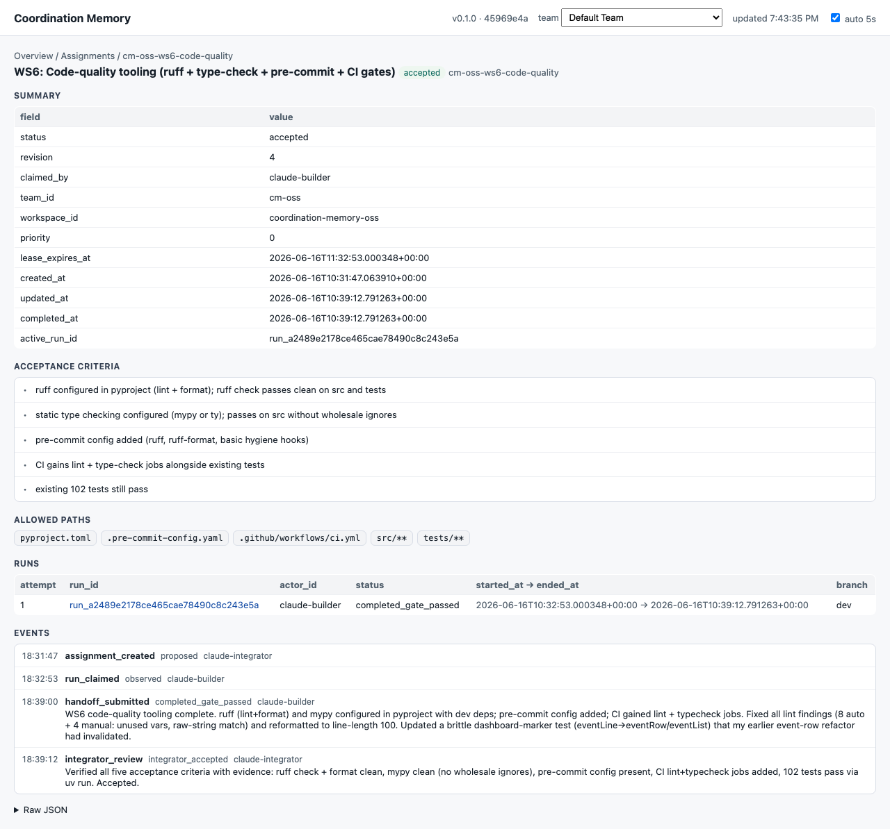

# Coordination Memory MCP

[](https://github.com/yanqiw/comem/actions/workflows/ci.yml)
[](https://pypi.org/project/coordination-memory-mcp/)
[](https://www.python.org/)
[](LICENSE)

<!-- mcp-name: io.github.yanqiw/comem -->

Append-only **coordination memory** for multi-agent (and agent + human) work,
exposed as a local [Model Context Protocol](https://modelcontextprotocol.io) (MCP)
server backed by SQLite — plus a local web management dashboard and goal-level
**acceptance contracts**.

It records *who owns which task*, run liveness, human interventions, handoff
evidence, and integrator review decisions. Only an **integrator** can promote work
into the accepted ledger, which you can export as a durable, auditable projection
(for example, committed into Git).

Design stance: the MCP is the **live coordination layer**; durable accepted truth
lives in whatever you project to. It is local-first (SQLite + stdio), and it never
deploys, never reads secrets, and never executes shell commands.

## Why

When several agents (or agents and people) push on the same body of work, two
things go wrong: they overwrite each other, and "I'm done" gets confused with
"this was accepted." Coordination Memory gives you:

- **Assignment claims with leases** so two actors don't clobber the same task.
- A hard distinction between an agent reporting `completed_gate_passed` and an
  integrator deciding `integrator_accepted`. Proposals are not truth.
- An **integrator-owned accepted projection** you review before archiving.
- **Acceptance contracts** that make "self-certified done" structurally
  impossible for goal-level outcomes (see below).

Good fits: multiple agents on separate worktrees advancing one effort; needing a
review gate before something counts as accepted; wanting a replayable audit trail
of coordination decisions.

Not a fit: as your only long-term source of truth; as a place to store `.env`
files, tokens, passwords, or credential-bearing logs.

## Launch resources

- [90-second demo script](docs/demo-script.md) — a short walkthrough for showing
  leases, handoff evidence, integrator acceptance, and the dashboard.
- [Launch post draft](docs/launch-post.md) — copy for announcing the project
  without positioning it as generic memory or RAG.
- [OSS launch checklist](docs/oss-launch-checklist.md) — release, GitHub
  metadata, MCP Registry, and directory-submission steps.

## Install

Requires Python ≥ 3.11.

Install the single `comem` command with
[uv](https://github.com/astral-sh/uv) or pipx after the package is published to
PyPI:

```bash
uv tool install coordination-memory-mcp   # or: pipx install coordination-memory-mcp
comem --help
```

Or run it without installing (the package name and command differ, so pass
`--from`):

```bash
uvx --from coordination-memory-mcp comem --help
```

### From source

If the PyPI page is not live yet, or you want to run your own changes, install
the `comem` command straight from a checkout:

```bash
git clone https://github.com/yanqiw/comem
cd coordination-memory-mcp
uv tool install .                  # or: pipx install .
comem --version
```

This is a snapshot install — re-run it after editing the source to pick up
changes:

```bash
uv tool install . --reinstall              # rebuild from current source
uv tool install . --editable --reinstall   # or install editable: changes apply live
uv tool uninstall coordination-memory-mcp  # remove it
```

The command exposes four subcommands:

- `comem serve` — the stdio MCP server.
- `comem dashboard` — the local web management console.
- `comem init` — scaffold agent-onboarding files into a repo.
- `comem loop` — run the local-only scheduler for Codex agent conversations.

For local development, clone and `uv sync`, then prefix commands with `uv run`.

## Quickstart

### Run the MCP server

```bash
comem serve
```

This starts a stdio MCP server (normally launched by an MCP client). It opens no
HTTP port and prints no interactive CLI.

The database defaults to `./.coordination-memory/coordination.sqlite3`. Override
it with `COORDINATION_MEMORY_DB`. When several agents/worktrees collaborate, point
**all** of them at one absolute path **outside** every worktree, or each worktree
gets its own SQLite copy and the shared memory forks:

```bash
COORDINATION_MEMORY_DB=/absolute/path/coordination.sqlite3 \
  comem serve
```

Do not commit the SQLite database to Git.

### Configure an MCP client

Client config locations differ, but with the command installed the server entry
should look like:

```json
{
  "mcpServers": {
    "coordination-memory": {
      "command": "comem",
      "args": ["serve"],
      "env": {
        "COORDINATION_MEMORY_DB": "/absolute/path/coordination.sqlite3"
      }
    }
  }
}
```

### Set up your agent

`comem init` scaffolds onboarding files so your coding agents know
the protocol, then prints this MCP config snippet:

```bash
comem init            # all tools, current directory
comem init --tools claude,cursor --dir ./my-repo
```

It writes a canonical **Coordination Memory protocol** section into `AGENTS.md`
(idempotently, between markers) and thin per-tool adapters that point to it:

| Tool | File written |
| --- | --- |
| Codex, OpenCode | `AGENTS.md` (read directly) |
| Claude Code | `.claude/skills/coordination-memory/SKILL.md` |
| Cursor | `.cursor/rules/coordination-memory.mdc` |
| GitHub Copilot | `.github/copilot-instructions.md` |

Re-running `init` updates the `AGENTS.md` section in place (no duplication).
Edit the protocol once in `AGENTS.md`; the adapters defer to it.

## Local loop

`comem loop` is the local-only scheduler for first-class Codex agent
conversations. The initial release supports `--adapter fake` for deterministic
testing and a guarded `--adapter codex-app-server` capability probe for future
local Codex app-server integration.

When Codex creates a workspace, team, and assignments for a plan, ask the user
to choose one execution mode before starting work:

- `codex_subagent` (default): the current Codex conversation remains the
  Integrator, starts Codex subagents as workers, and records claims,
  heartbeats, handoffs, and reviews in Coordination Memory.
- `comem_loop`: Codex starts `comem loop` with the selected workspace/team and
  the loop owns worker claims and thread starts.

Use `codex_subagent` for the smoothest Codex experience. Use `comem_loop` when
worker conversations must be independently resumable or scheduler-owned.

Dry-run scheduling:

```bash
COORDINATION_MEMORY_DB=/absolute/path/coordination.sqlite3 \
  comem loop --workspace <workspace_id> --team <team_id> --adapter fake --dry-run --once
```

Fake local dispatch:

```bash
COORDINATION_MEMORY_DB=/absolute/path/coordination.sqlite3 \
  comem loop --workspace <workspace_id> --team <team_id> --adapter fake --once
COORDINATION_MEMORY_DB=/absolute/path/coordination.sqlite3 \
  comem loop --workspace <workspace_id> --team <team_id> --adapter fake --poll-interval 30
```

Loop-managed assignments should carry `metadata.session_bind.target_actor_id`
so the scheduler knows the intended worker before any run exists. The actual
Codex thread binding is recorded on the run after claim/start. Project design
and plan context must remain in Markdown files; assignments should reference
those files through metadata `context_refs`.

## Concepts

The store is six core tables:

- **workspace → team → assignment → run → event**, plus **actors**.
- An **assignment** is a unit of work. Claiming one starts a **run** and takes a
  lease. **Events** are the append-only log (evidence, handoffs, reviews, …).
- Actors act in a **role**: `integrator`, `agent`, or `human`.
- Mutating writes use **optimistic concurrency**: each carries the current
  `base_revision` and bumps the revision.

Event statuses an **agent** may submit: `proposed`, `observed`,
`completed_gate_passed`, `completed_gate_failed`. Decision statuses are
**integrator-only**: `integrator_accepted`, `integrator_rejected`, `needs_fix`.
`completed_gate_passed` is *not* accepted truth — only an integrator review
decision produces accepted state.

## Tools

**Coordination**

| Tool | Role | Purpose |
| --- | --- | --- |
| `register_actor` | any | register/refresh an actor profile |
| `register_workspace` | any | create/refresh a workspace record (idempotent) |
| `create_team` | any | create/refresh a team (auto-creates its workspace) |
| `create_assignment` | integrator | create a task (optional workspace/team/paths/criteria) |
| `cancel_assignment` / `supersede_assignment` | integrator | void / retire a task (releases any lease) |
| `claim_assignment` | agent | claim a lease; records run/session/worktree metadata |
| `heartbeat_run` | agent | report run liveness |
| `request_intervention` / `respond_intervention` | agent / human | move a run to/from an awaiting-human lane |
| `append_event` / `submit_handoff` | agent | append evidence / submit a reviewable handoff |
| `list_pending_reviews` | any | reviewable events with no decision yet |
| `review_event` / `accept_event` / `reject_event` | integrator | record a review decision |
| `get_team_board` / `get_assignment_detail` / `get_run_detail` | any | read models |
| `get_snapshot` / `export_git_projection` | integrator | accepted projection (see below) |

**Acceptance contracts**

`create_acceptance_contract`, `add_invariant`, `raise_deviation`,
`bind_assignment_to_contract`, `seal_contract`, `report_verification`,
`evaluate_contract`, `accept_contract`, `reject_contract`, `waive_deviation`,
`reopen_contract`, `get_contract_detail`, `list_contracts`.

Mutating tools take a `base_revision` and reject stale writes. Run/intervention
tools only change local lanes and the event timeline; they never execute commands,
resume threads, or touch files.

## Acceptance contracts (goal-level governance)

An **acceptance contract** is a first-class object that sits above assignments and
defines machine-checkable, non-self-certifiable acceptance criteria for a
**goal-level outcome**. It is a structural protection layer whose purpose is to make
"the implementer declares it done" impossible.

### Data model

| Table | Role |
| --- | --- |
| `acceptance_contracts` | the contract: `goal_statement`, `status` (state machine), `revision` (optimistic concurrency), `acceptor_actor_id` (independent acceptor), `max_repair_attempts`/`repair_attempt` (loop bounds), `last_failing_keys_json` (no-progress brake) |
| `contract_invariants` | one machine-checkable predicate per row: `probe_kind` (`command`/`http`/`sql`/`file_assert`/`artifact_present`), `probe_spec_json` (references only — no secrets), `is_negative` (a deny test), `is_second_instance` (a second-tenant/second-instance test). Frozen after seal. |
| `contract_verifications` | append-only probe results: `outcome` (`passed`/`failed`/`error`), `evidence_json` (log path / commit / response hash — references only). "Pass or not" is decided by the latest probe result; a runner cannot mark a predicate passed by fiat. |
| `contract_deviations` | a deviation/shortcut register: `disposition` is **required** (`acceptable_forever`/`acceptable_this_phase`/`blocker`). While any `blocker` is `open`, the contract cannot reach `accepted`. |

### Three gates

1. **`seal_contract`** (`drafting → criteria_sealed`) — refuses to seal unless there
   is at least one deny test, at least one second-instance test, every invariant
   has a probe spec, and the bound acceptor is **not** an actor that ran a bound
   assignment. Invariants freeze after seal; the only way to change them is
   `reopen_contract` (a loud reset that clears the seal and prior probe results).
2. **`evaluate_contract`** — the objective gate and self-healing loop driver. It
   needs no acceptor, so the loop self-drives. If every required invariant's latest
   result is `passed` and no blocker is open → `awaiting_acceptor`. Otherwise it
   bumps the attempt and emits a bound repair assignment for an external
   scheduler/runner to pick up; bounded by `max_repair_attempts` and a no-progress
   brake (failing set must strictly shrink), after which it escalates to
   `awaiting_human`. A bound runner cannot call `evaluate`/`accept` on its own
   contract.
3. **`accept_contract`** (`awaiting_acceptor → accepted`) — only the independent
   acceptor may sign off, certifying the invariant *set* adequately covers the
   goal (green is already objective fact). `reject_contract` sends it to
   `awaiting_human`.

```
drafting ──seal──▶ criteria_sealed ──(report_verification)──▶ verifying
                                                                  │
                                                          evaluate (objective gate)
                                    ┌─────────────────────────────┼──────────────────────────┐
                             all required green             some failed / open blocker
                             AND no open blocker                       │
                                    │                       enter repair loop (bounded)
                            awaiting_acceptor                          │
                                    │                         repair_attempt > max OR
                              accept / reject                   no-progress → awaiting_human
                                    │
                             accepted / awaiting_human
```

The gate logic lives entirely in the store layer (`store.py`) — there is no prompt
or client that can bypass it.

## Dashboard (local management console)

A local, single-page management dashboard over the same SQLite memory. A small
stdlib HTTP server serves the Svelte/Vite-built static SPA plus JSON APIs. Read
APIs open the DB with `mode=ro` + `query_only` and fail rather than creating a
missing DB. The only write action is **Archive workspace**, which soft-updates
`workspaces.status` to `archived` through
`POST /api/workspaces/<id>/archive`; it never deletes tasks, runs shell, deploys,
or pushes.

```bash
COORDINATION_MEMORY_DB=/absolute/path/coordination.sqlite3 \
  comem dashboard --host 127.0.0.1 --port 8765
```



Open `http://127.0.0.1:8765/`. It shows a board-first **Overview** (assignment
lanes + an Acceptance Contracts section with a stat strip and "needs attention" /
"in flight" cards), a **Workspaces** management page with workspace and agent-team
status counts, workspace detail pages with teams and assignments, and drill-downs for a contract (gate
stepper, invariants, deviations, repair-loop/event timeline, bound assignments),
an assignment, or a run — each a readable summary plus a collapsed "Raw JSON"
panel. A team switcher and a 5s auto-refresh (overview only, paused while you
select text or the tab is hidden) live in the header, and the header shows a build
hash so you can tell when the UI changed. The same data is available as JSON:
`/api/workspaces`, `/api/workspaces/<id>`, `POST /api/workspaces/<id>/archive`,
`/api/board`, `/api/governance`, `/api/contracts` (+ `/api/contracts/<id>`),
`/api/assignments/<id>`, `/api/runs/<id>`, `/api/teams`, `/api/reviews`,
`/api/version`.

## Accepted projection (export)

`get_snapshot` returns the accepted read model derived from the store — only events
an integrator accepted. `export_git_projection` writes (integrator-only) to a
directory you choose:

```json
{ "output_dir": "/tmp/coordination-projection", "actor_role": "integrator" }
```

produces:

```text
/tmp/coordination-projection/coordination-memory/snapshots/accepted-state.json
/tmp/coordination-projection/coordination-memory/events/accepted-events.md
```

Review the export before committing it anywhere. The tool writes only to the
directory you pass; it never overwrites other files.

## Security boundaries

- Does not read or commit `.env` files; does not store secrets, tokens, passwords,
  or private keys. Contract `probe_spec`, verification `evidence`, and all metadata
  hold **references only** (paths, commits, hashes).
- Does not execute deployments, shell commands, or version-control pushes. The
  acceptance-contract repair loop only emits an assignment record; execution stays
  in your own (externally authorized) scheduler/runner.
- Dashboard read APIs are read-only. The dashboard's only write action is
  **Archive workspace**, a soft workspace status update; it does not delete data,
  execute commands, deploy, or push.

## Development

```bash
uv sync
uv run pytest -q
uv run ruff check src tests        # lint
uv run ruff format --check src tests
uv run mypy src                    # type check
uv run pre-commit install          # optional: run lint/format on commit
npm test                           # frontend unit tests
npm run build                      # rebuild Svelte dashboard static assets
```

More docs: [docs/](docs/) (quickstart, concepts/governance, tool reference,
examples). See [CONTRIBUTING.md](CONTRIBUTING.md) for the invariants a change
must preserve, and [CHANGELOG.md](CHANGELOG.md) for release notes.

## License

[MIT](LICENSE).
